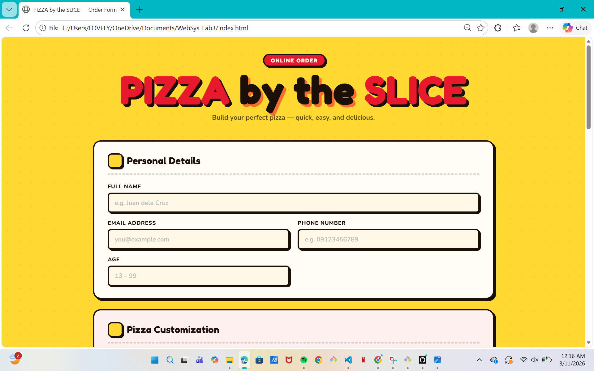
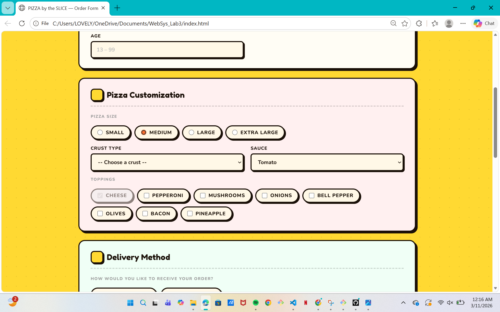
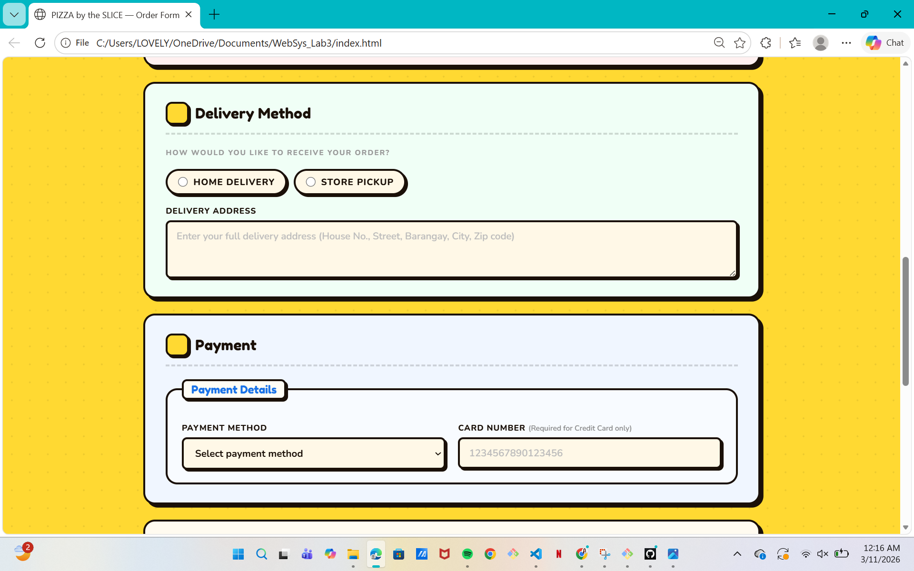
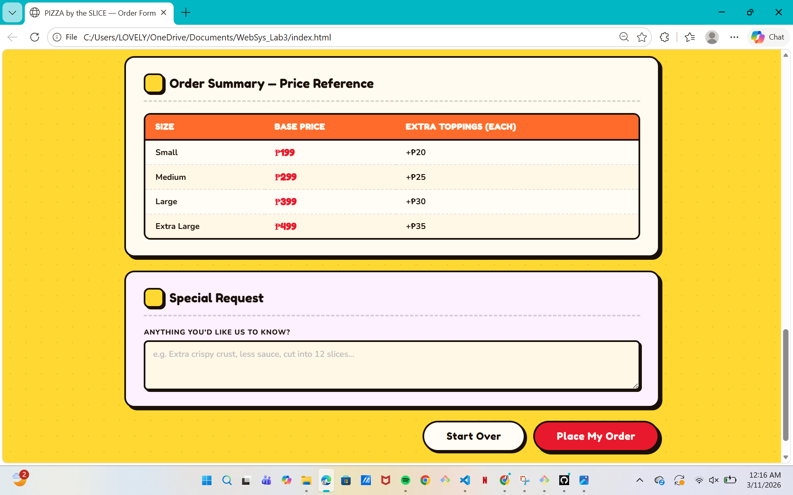

# PIZZA by the SLICE — Online Order Form
**Web Systems and Technology | Laboratory 3**

## Preview

## Screenshots
### Personal Details & Pizza Customization

### Delivery & Payment

### Order Summary

## Description
An HTML form for a pizza ordering system built using only HTML and CSS. No JavaScript was used, all validation is done through HTML attributes and form features.

## Files
- `index.html` — Main order form
- `style.css` — Stylesheet for the form

## Group Members
- Perea, Alrich John — Personal Details & Pizza Customization
- Moreno, Sophia Elysse — Delivery Method & Payment
- Kelly, Lovely Joy — Order Summary Table, Buttons & Integration

## How to Run
Just open `index.html` in any browser. No server is needed since it's a static page. You can fill out the form and submit it to see the validation in action.